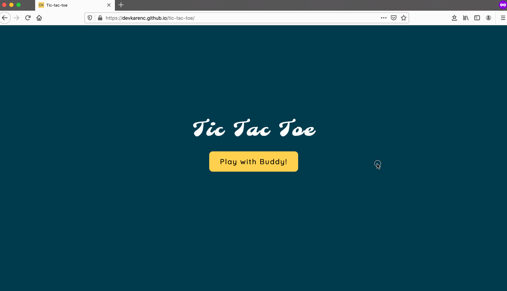

# Tic-Tac-Toe

With this project, you can play a game of tic-tac-toe with your buddy. It is built with HTML, CSS, vanilla JavaScript and the Module Pattern. There are two main modules: Game and the Gameboard, and one factory function: Player. Each module and factory function has its own private properties/methods as well as public properties/methods available to others. No global variables were declared as I used the IIFE (Immediately Invoked Function Expression). The game was tested in both Chrome and Firefox browsers.

This tic-tac-toe game can:

- [x] Allow players to enter names
- [x] Notify in text and visual aid which player should go next
- [x] Prevent players from placing a symbol in the grid that's already taken
- [x] Display a win or a tie message after the game is over
- [x] Prevent players from manipulating the board upon game over
- [x] Restart the game without refreshing the page

🎮 Play with a buddy [here](https://devkarenc.github.io/tic-tac-toe/)!

## Demo Game Play

